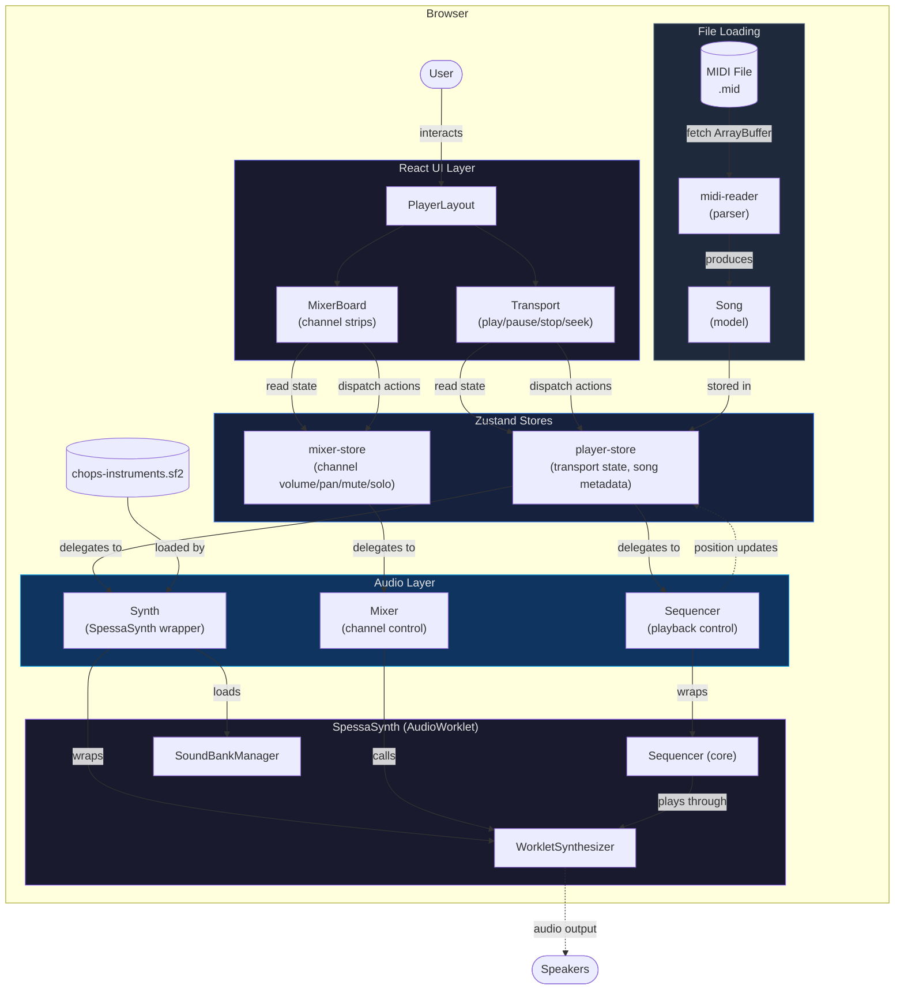

# chops-player — Architecture

> **Status: REVISED — Phase A review fixes applied; ADR-008 added (stores→parsers)**
>
> Authored by `@architect`. Revised to address reviewer findings.
> Last updated: 2026-04-07

---

## 1. System Overview

**chops-player** is a browser-based jazz backing track player built as an embeddable React component (`<ChopsPlayer />`). In Phase I, it loads a Standard MIDI File, plays it back through SpessaSynth (an AudioWorklet-based SoundFont synthesizer), and provides transport controls (play/pause/stop/seek) and a per-channel mixer (volume/pan/mute/solo).

The system is organized into strict horizontal layers. **Model** defines pure data types. **Parsers** convert external file formats into model types. **Audio** owns all Web Audio API and SpessaSynth interaction — it is the only layer that creates `AudioContext`, `AudioWorkletNode`, or calls SpessaSynth methods. **Stores** (Zustand) bridge the React UI to the audio layer: components read state from stores, and stores expose actions that delegate to the audio layer. **Components** are pure renderers — they read from stores and emit user intents via store actions; they never touch audio or engine code directly.

Data flows in one direction: **file → parser → model → store → audio → speakers**, with position/state updates flowing back **audio → store → component**. This separation ensures that the model and parser layers are fully testable in Node.js without mocking Web Audio, while the audio layer can be tested by mocking SpessaSynth at its public API boundary.

---

## 2. Layer Boundaries (Mandatory Constraints)

These constraints are locked and must not be violated by any implementing agent:

| Layer | Directory | Allowed dependencies | Forbidden |
|---|---|---|---|
| **Model** | `src/model/` | None (pure data types and pure functions) | React, Zustand, Web Audio API, SpessaSynth |
| **Engine** | `src/engine/` | `model/` only | React, Zustand, Web Audio API, SpessaSynth |
| **Audio** | `src/audio/` | `model/`, `engine/`, SpessaSynth, Web Audio API | React, Zustand |
| **Parsers** | `src/parsers/` | `model/` only | React, Zustand, Web Audio API, SpessaSynth |
| **Stores** | `src/stores/` | `model/`, `audio/`, `parsers/`, Zustand, React | `engine/` directly |
| **Components** | `src/components/` | `stores/`, `model/`, React, Tailwind | `audio/`, `engine/`, `parsers/` directly |
| **Utils** | `src/utils/` | None (pure helpers) | Everything else |

### Import rules summary

- Components read stores, never reach into audio.
- Stores call audio layer actions and expose reactive state. Stores may also call parsers to transform raw file data into model types (see ADR-008).
- Audio layer uses SpessaSynth and Web Audio API — it subscribes to store state but never imports React or Zustand.
- Parsers produce model types from raw data — pure functions, no side effects.
- Model is the foundation — importable everywhere, depends on nothing.

---

## 3. Component Diagram

---

## 4. Data Flow: MIDI File → Audio

This is the step-by-step walkthrough from "user provides a MIDI URL" to "first sound comes out of the speakers":

### 4.1 Initialization (deferred to first user gesture — see ADR-005)

1. **`<ChopsPlayer midiUrl="..." />` mounts.** The `PlayerLayout` component renders and the `player-store` initializes with default state (`isReady: false`, `state: "stopped"`). **No AudioContext or audio resources are created at mount time.**
2. **First user gesture (e.g., Play button click).** The store action calls `Synth.initialize()` in the audio layer, which creates a new `AudioContext` (now guaranteed to start in "running" state) and registers the SpessaSynth AudioWorklet processor (`spessasynth_processor.min.js`).
3. **WorkletSynthesizer instantiation.** After the worklet is registered, a `WorkletSynthesizer` instance is created and connected to `audioContext.destination`.
4. **SoundFont loading.** `Synth.loadSoundFont(url)` fetches `chops-instruments.sf2` as an `ArrayBuffer` and calls `synth.soundBankManager.addSoundBank(buffer, "main")`. Progress events are forwarded to the store.
5. **Synth ready.** `await synth.isReady` resolves. The synth is now ready to receive MIDI events. The store updates `isReady: true`.
6. **Subsequent calls.** If `initialize()` is called again after the synth is already initialized, it is a no-op.

### 4.2 MIDI file loading

6. **MIDI fetch.** The store action fetches the MIDI file URL as an `ArrayBuffer`.
7. **Parse to Song model.** `parseMidiFile(buffer)` in `src/parsers/midi-reader.ts` parses the raw MIDI into a `Song` model (pure data: tracks, tempo map, time signatures, metadata).
8. **Store the Song.** The `player-store` stores the parsed `Song` and updates the `mixer-store` with the channel list (names, programs, drum flag).
9. **Load into Sequencer.** The store action calls `Sequencer.load(song)` in the audio layer, which creates a SpessaSynth `Sequencer` instance and loads the MIDI data via `sequencer.loadNewSongList([...])`.

### 4.3 Playback

10. **User presses Play.** The `Transport` component dispatches `playerStore.play()`.
11. **Store delegates to audio.** `player-store.play()` calls `Sequencer.play()`, which calls `spessaSynthSequencer.play()`.
12. **SpessaSynth plays.** The AudioWorklet sequencer sends MIDI events to the synthesizer in real time, rendering audio through the AudioWorklet.
13. **Position updates.** The sequencer wrapper polls `spessaSynthSequencer.currentTime` on a `requestAnimationFrame` loop (or uses the sequencer's `timeChange` event) and pushes `PlaybackPosition` updates to the `player-store`.
14. **UI updates.** React components re-render via Zustand selectors when position/state changes.

### 4.4 Mixer interaction

15. **User adjusts volume on channel 0.** The `MixerChannel` component dispatches `mixerStore.setVolume(0, 75)`.
16. **Store delegates to audio.** `mixer-store.setVolume()` calls `Mixer.setVolume(0, 75)` in the audio layer.
17. **Mixer sends CC.** `Mixer.setVolume()` calls `synth.controllerChange(0, midiControllers.mainVolume, scaledValue)` on the SpessaSynth synthesizer, mapping the 0–100 range to MIDI CC7 (0–127).

---

## 5. Key Interfaces (Stubs)

All interfaces are defined as TypeScript types in `src/`. Implementation is deferred to Phase B/C.

| File | Key types | Layer |
|---|---|---|
| `src/model/song.ts` | `Song`, `Track`, `NoteEvent`, `TempoEvent`, `TimeSignatureEvent` | Model |
| `src/model/constants.ts` | `GM_PROGRAMS`, `DRUM_CHANNEL`, `DEFAULT_TEMPO` | Model |
| `src/audio/synth.ts` | `SynthOptions`, `Synth` | Audio |
| `src/audio/sequencer.ts` | `PlaybackState`, `PlaybackPosition`, `Sequencer` | Audio |
| `src/audio/mixer.ts` | `ChannelState`, `Mixer` | Audio |
| `src/parsers/midi-reader.ts` | `MidiParseError`, `parseMidiFile`, `isMidiFile` | Parsers |

---

## 5a. Requirement Traceability

Maps each requirement group to the interfaces and components that satisfy it. This allows the test-builder to trace every requirement to a testable interface method.

| Requirement Group | Interface / Component | Key Methods / Properties |
|---|---|---|
| **P1-SF** (SoundFont Loading) | `Synth` (`src/audio/synth.ts`) | `loadSoundFont(url, onProgress?)`, `isReady` |
| **P1-SY** (Synthesizer Init) | `Synth` (`src/audio/synth.ts`) | `initialize()`, `isReady`, `audioContext`, `dispose()` |
| **P1-TR** (Transport) | `Sequencer` (`src/audio/sequencer.ts`) | `load()`, `play()`, `pause()`, `stop()`, `seekToTick()`, `seekToBar()`, `state`, `position`, `loop`, `onPositionChange` |
| **P1-MX** (Mixer) | `Mixer` (`src/audio/mixer.ts`) | `setVolume()`, `setPan()`, `setMute()`, `setSolo()`, `getChannelState()`, `getAllChannelStates()` |
| **P1-ST** (State Management) | `player-store`, `mixer-store` (`src/stores/`) | Store actions mirror `Synth`/`Sequencer`/`Mixer` methods |
| **P1-MR** (MIDI Reader) | `parseMidiFile`, `isMidiFile` (`src/parsers/midi-reader.ts`) | `parseMidiFile(buffer)` → `Song`, `isMidiFile(buffer)` → `boolean` |
| **P1-UI** (UI Components) | `PlayerLayout`, `Transport`, `MixerBoard` (`src/components/`) | Read from stores only, no direct audio imports |
| **P1-NF** (Non-Functional) | All layers | Layer constraints (§2), `strict: true`, named exports, no `any` |
| **P1-SF-003** (Typed errors) | `ChopsPlayerError` (`src/model/errors.ts`), `MidiParseError` (`src/parsers/midi-reader.ts`) | Error classes with `code`/`name` properties |

---

## 6. Phase I Scope Boundary

### In scope (Phase I)

- Load a Standard MIDI File (Type 0 or Type 1) from a URL
- Parse MIDI into a `Song` model (tracks, tempo, time signatures, note events)
- Initialize SpessaSynth with the AudioWorklet processor
- Load `chops-instruments.sf2` SoundFont (Piano, Jazz Guitar, Acoustic Bass, Drums)
- Transport: play, pause, stop, seek (by time and by bar)
- Position tracking (tick, seconds, bar, beat) with UI updates
- Per-channel mixer: volume (0–100), pan (-100 to +100), mute, solo
- 16-channel MIDI support
- Zustand stores for transport state and mixer state
- React UI: Transport bar, MixerChannel strip, MixerBoard, PlayerLayout
- Embeddable as `<ChopsPlayer midiUrl="..." />`
- Desktop browser support (Chrome, Firefox, Safari)

### Out of scope (deferred)

| Feature | Deferred to |
|---|---|
| Chord chart parsing (JJazzLab `.sng`) | Phase II |
| Algorithmic MIDI generation (bass, drums, piano) | Phase II |
| Styled chord grid with playback marker | Phase III |
| Styles/rhythms library, song structure | Phase IV |
| Audio effects (reverb, chorus beyond SpessaSynth built-in) | Phase V |
| Custom SoundFont loading / CDN | Phase V |
| iReal Pro format support | Phase V |
| Mobile support (iOS Safari AudioWorklet) | Phase V |
| Audio file export (WAV/MP3) | Phase V |
| Loop region selection UI | Phase III |
| Tempo override / playback rate | Phase II |

---

## 7. Architecture Decision Records

### ADR-001: SpessaSynth as audio engine (LOCKED)

**Decision:** Use `spessasynth_lib` (Apache-2.0) as the SoundFont synthesizer.

**Context:** Browser-based jazz playback requires a SoundFont synthesizer that runs entirely in the browser. Options evaluated: SpessaSynth, openDAW, Tone.js, WebAudioFont.

**Rationale:**
- Full TypeScript, AudioWorklet-based, no COOP/COEP headers required
- Apache-2.0 license (compatible with MIT project)
- Built-in sequencer, SoundFont 2/3 support, active maintenance
- openDAW rejected: AGPL-3.0 viral, deeply coupled to custom JSX/Box reactive system
- Tone.js rejected: no SoundFont support
- WebAudioFont rejected: GPL-3.0, dated

**Status:** LOCKED — do not revisit unless SpessaSynth becomes unmaintained.

### ADR-002: Extracted trimmed SF2 for Phase I (LOCKED)

**Decision:** Use a custom-extracted `chops-instruments.sf2` (~3-5 MB) containing only the 4 instruments needed for Phase I backing tracks. No CDN, no server required.

**Instruments (Phase I):** Acoustic Grand Piano (GM 0), Jazz Guitar (GM 26), Acoustic Bass (GM 32), Standard Drums (Bank 128/Preset 0).

**Status:** LOCKED for Phase I. Full instrument selection revisited in Phase V.

### ADR-003: Embeddable widget architecture (LOCKED)

**Decision:** Build as an embeddable React component (`<ChopsPlayer />`). No global CSS assumptions. Publishable as an npm package.

**Status:** LOCKED.

### ADR-004: Wrap SpessaSynth behind local interfaces

**Decision:** Define `Synth`, `Sequencer`, and `Mixer` interfaces in `src/audio/` that wrap SpessaSynth's `WorkletSynthesizer` and `Sequencer` classes. The rest of the system never imports from `spessasynth_lib` directly.

**Context:** SpessaSynth's API is rich but tightly coupled to Web Audio API concepts. Wrapping it behind our own interfaces provides:
1. **Testability** — tests can mock `Synth`/`Sequencer`/`Mixer` without knowing SpessaSynth internals.
2. **Stability** — if SpessaSynth API changes between versions, only the wrapper implementation changes.
3. **Simplification** — our interfaces expose only what Phase I needs, hiding the full SpessaSynth surface.

**SpessaSynth API mapping:**
- `Synth.initialize()` → `new AudioContext()` + `audioContext.audioWorklet.addModule(workerUrl)` + `new WorkletSynthesizer(ctx)`
- `Synth.loadSoundFont()` → `synth.soundBankManager.addSoundBank(buffer, id)`
- `Sequencer.load()` → `new Sequencer(synth)` + `sequencer.loadNewSongList([midi])`
- `Sequencer.play()/pause()` → `sequencer.play()/pause()`
- `Sequencer.seekToTick()` → `sequencer.currentTime = seconds` (converted via `BasicMIDI.midiTicksToSeconds`)
- `Mixer.setVolume()` → `synth.controllerChange(ch, midiControllers.mainVolume, v)`
- `Mixer.setPan()` → `synth.controllerChange(ch, midiControllers.pan, v)`
- `Mixer.setMute()` → `synth.muteChannel(ch, muted)`

**Status:** ACCEPTED.

### ADR-005: AudioContext lifecycle — lazy creation on first user gesture

**Decision:** The `AudioContext` is NOT created at component mount time. It is created lazily on the first user gesture (e.g., pressing Play). This avoids the browser autoplay policy warning and ensures `AudioContext` starts in "running" state.

**Context:** Chrome, Firefox, and Safari all suspend `AudioContext` instances created without a user gesture. Calling `ctx.resume()` is unreliable on some browsers. By deferring creation to a click handler, we guarantee the context is "running" from the start.

**Implementation:** The `player-store` exposes an `initialize()` action. The first call to `play()` (or an explicit "Initialize" button) triggers `AudioContext` creation → worklet registration → synth instantiation → SoundFont loading. Subsequent calls are no-ops if already initialized.

**Status:** ACCEPTED.

### ADR-006: MIDI parsing — own model, not SpessaSynth's BasicMIDI

**Decision:** The `parseMidiFile()` function in `src/parsers/midi-reader.ts` parses MIDI into our own `Song` model (`src/model/song.ts`), not into SpessaSynth's `BasicMIDI` class.

**Context:** SpessaSynth provides `BasicMIDI.fromArrayBuffer()` which parses MIDI files directly. However:
1. `BasicMIDI` is a heavy class with many SpessaSynth-specific properties (loop detection, karaoke support, port mapping) that we don't need.
2. Our `Song` model is a pure data type — plain objects with no methods, no class instances — making it serializable, testable, and layer-compliant.
3. The audio layer will convert `Song` → `BasicMIDI` (or pass the raw `ArrayBuffer` directly to SpessaSynth's sequencer via `loadNewSongList([{ binary }])`) when loading into the sequencer.

**Trade-off:** We write our own minimal MIDI parser for Phase I. It only needs to handle Type 0 and Type 1 SMF, extract note-on/off, tempo, time signature, and track names. This keeps the parser layer pure and independent of SpessaSynth.

**Alternative considered:** Parse with `BasicMIDI.fromArrayBuffer()` in the audio layer and extract a `Song` model from it. This was rejected because it would couple the parser layer to SpessaSynth.

**Status:** ACCEPTED.

### ADR-007: Position updates via requestAnimationFrame polling

**Decision:** The sequencer wrapper updates playback position by polling `sequencer.currentHighResolutionTime` on each `requestAnimationFrame` tick, rather than relying solely on SpessaSynth's `timeChange` event.

**Context:** SpessaSynth's sequencer emits `timeChange` events, but only when the time is explicitly set (seek). For smooth UI updates during playback, we need position at ~60fps. The `currentHighResolutionTime` getter provides a smoothed time value ideal for visualization.

**Implementation:** The sequencer wrapper starts a rAF loop when playing, stops it when paused/stopped. On each frame, it reads `currentHighResolutionTime`, converts to tick/bar/beat using the tempo map, and invokes `onPositionChange`. The store updates only when the value has meaningfully changed (debounced by bar/beat granularity for the store, full precision for the callback).

**Status:** ACCEPTED.

### ADR-008: Stores may import parsers (layer matrix correction)

**Decision:** The `stores/` layer is permitted to import from `parsers/`. The layer boundary table in §2 is updated to list `parsers/` as an allowed dependency of `stores/`.

**Context:** The original layer matrix (§2) listed `stores/` allowed imports as `model/`, `audio/`, Zustand, React — omitting `parsers/`. However, the data flow description (§1) states "file → parser → model → store → audio → speakers", and the MIDI loading walkthrough (§4.2) explicitly describes the `player-store.loadMidi()` action calling `parseMidiFile()` from `src/parsers/midi-reader.ts`. The Phase D2 reviewer flagged this import as a layer violation based on the matrix.

**Analysis:**

1. The omission was an oversight, not an intentional design constraint. The architect authored §4.2 to show the store calling the parser directly, but failed to update the layer table to match.
2. `parsers/` is a pure-function layer — it depends only on `model/` and has zero side effects. It is architecturally at the same purity tier as `model/` itself. Allowing `stores/` to call pure parser functions is strictly downward in the dependency graph and introduces no coupling risk.
3. The alternative — moving parsing into `audio/` or creating a new orchestration layer — would be architecturally worse:
   - Putting parsing in `audio/` conflates "file format transformation" with "audio rendering."
   - A new orchestration layer is overengineering for a call that is a single pure function invocation.
4. Requirement P1-ST-005 ("stores contain NO audio/MIDI **business logic**") is not violated: calling a pure parser function is data transformation at a system boundary, not business logic.

**Change applied:**
- §2 layer table: `stores/` allowed dependencies updated to `model/`, `audio/`, `parsers/`, Zustand, React.
- §2 import rules summary: clarified that stores may call parsers for file-to-model transformation.
- `docs/30-development/coding-guidelines.md` §3 layer table: updated to match.

**Status:** ACCEPTED.
